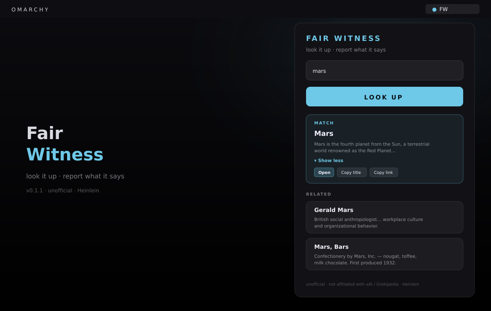

# Encyclopedic



Look it up. Report what it says. Unofficial.

Public Grokipedia full-text search for Omarchy — one field, **LOOK UP**, result
cards. Named for Heinlein’s Encyclopedic (*Stranger in a Strange Land*). No API
keys. No vendor chrome.

**ID:** `kenhara.encyclopedic`  
**Author:** Harris Kenny  
**License:** MIT  
**Version:** 0.1.17

### 0.1.17
- Header: FA magnifying glass (`\uf002`) left of ENCYCLOPEDIC (same as bar chip).

### 0.1.16
- **Preview** fetches the full Grokipedia article (`/api/page-preview`) and shows it in the panel — not a no-op snippet line-count bump.
- **Show more** expands/collapses the loaded in-panel body (fetches if needed).
- One accent per card: Preview. Open and Copy Link are secondary.
- Quiet copy: subheader *look it up*; footer *Unofficial · Grokipedia*.

### 0.1.15
- Bar chip: tintable FA magnifying glass (`\uf002`, Nerd Font search) at `Style.font.caption` — no emoji.
- Result actions always visible (hero + related + flat): **Preview** (`\uf06e` eye, in-panel; no `xdg-open`), **Open** (`\uf08e` external-link, browser), **Copy Link** (`\uf0c5` copy). Copy title removed.

### 0.1.14
- Bounded retry on Grokipedia 502/503/504/timeout; friendly transient error + panel Try again (raw Cloudflare detail kept out of UI).

### 0.1.13
- KeyboardPanel + PanelKeyCatcher shell (Compliantish/Rocketlauncher) so nested bar-widget panels open on Quattro VPS; BarWidget toggle warns if panelLoader.item is null.

### 0.1.12
- F1: replace Style.font.title/subtitle with Style.font.body (oracle rocketlauncher tokens only) so panels load on VPS/smoke Omarchy.

### 0.1.11
- Remove Panel `import "."` (was shadowing qs.Ui Panel under Loader → dead bar clicks); sibling types via qmldir/module context like Rocketlauncher.

### 0.1.10
- python3 -B + PYTHONDONTWRITEBYTECODE on search Process (stops __pycache__ reload storms); panel load error console.warn + truncated tooltip.

### 0.1.9
- Bar chip emoji 📖 (glyph-only); Panel `import "."` so Loader resolves sibling types; best-effort panel load error in tooltip.

### 0.1.6
- Renamed plugin id `harris.encyclopedic` → `kenhara.encyclopedic` (install path `~/.config/omarchy/plugins/kenhara.encyclopedic`). Display name unchanged.

### 0.1.5
- Discoverability: expanded `keywords` + restored `barWidget.aliases` for search docs; honest note (loader may not index aliases).

### 0.1.3
- Pre-ship checklist (`PRE-SHIP.md`): README hero `preview.png`, `"monospace"` font fallback, drop unused `panelOpen`, version sync.

### 0.1.2
- Audit harden (see `AUDIT.md` / `AUDIT-NOTES.md`): unescape-before-strip HTML,
  `Text.PlainText` on remote title/snippet/WITNESS, https-only Open,
  `Quickshell.clipboardText` + honest copy toasts, `resultLimit` integer bounds,
  FileView cache (no mkdir race), keep prior results on failed lookup, drop dead
  summon/`aliases`, hover, focus-on-open, UA from `manifest.json`.

### 0.1.1
- Direct-match **hero**: when title or slug equals the query (CI), show an
  expandable MATCH preview at top (collapsed snippet + Show more; expanded
  fuller snippet + Open / Copy title / Copy link). **RELATED** cards below for
  everything else. No fake hero when there is no direct match.
- `scripts/search.py` and `WitnessStore` emit/compute `{ primary, related, results }`.

### 0.1.0
- MVP — bar `● FW`, panel search, `scripts/search.py` → Grokipedia public
  full-text search, result cards (Open / Copy title / Copy link), selected
  WITNESS snippet card, disk cache, middle-click clear, schema `resultLimit`.

## Repository

**GitHub:** https://github.com/kenhara/omarchy-encyclopedic  
Local folder: **`omarchy-encyclopedic`**.

## Unofficial disclaimer

**Encyclopedic is unofficial.** It is **not** affiliated with, endorsed by, or
sponsored by xAI, Grokipedia, or any related entity. “Encyclopedic” is a
literary reference to Robert A. Heinlein’s *Stranger in a Strange Land*. This
plugin is a thin personal client that calls a **public read** HTTP search API.
See **Discoverability** below — keywords may help marketplace/search; the
display name stays brand-free.

## Discoverability

Marketplace filing: **Productivity** · tags `bar, quickshell`.

Top-level `keywords` in `manifest.json` may help marketplace/search
(Grokipedia, Grok, Wikipedia, Heinlein, xAI, encyclopedia, etc.).
`barWidget.aliases` are for discovery docs and human search — the bar loader
may not index them. Display name stays **Encyclopedic** (no Grok in the title).

## Install

### From GitHub

```sh
omarchy plugin add https://github.com/kenhara/omarchy-encyclopedic.git --enable
omarchy bar move kenhara.encyclopedic --section right
```

### Local copy (this tree)

The **git repo root is the plugin** (`manifest.json` at root). On an Omarchy
machine:

```sh
mkdir -p ~/.config/omarchy/plugins
cp -a . ~/.config/omarchy/plugins/kenhara.encyclopedic

omarchy plugin validate ~/.config/omarchy/plugins/kenhara.encyclopedic
omarchy-shell shell rescanPlugins

omarchy bar move kenhara.encyclopedic --section right
```

Hot reload applies on save under `~/.config/omarchy/plugins/`.

### Symlink (dev)

```sh
mkdir -p ~/.config/omarchy/plugins
ln -sfn /path/to/omarchy-encyclopedic ~/.config/omarchy/plugins/kenhara.encyclopedic
omarchy-shell shell rescanPlugins
```

## Configure

Open **widget settings** for Encyclopedic (optional):

| Schema key | Label | Default |
|------------|-------|---------|
| `resultLimit` | Result limit (1–20) | `8` |

No API keys. Public read only.

CLI smoke:

```sh
python3 scripts/search.py --query 'mars' --limit 8
python3 scripts/search.py --dry-run --query 'mars'
```

## Usage

1. **Left-click** bar search glyph → panel.
2. Type or paste a topic into the one field.
3. Hit **LOOK UP** (or Enter).
4. If the query exactly matches a title or slug, a **MATCH** hero appears at
   the top (expandable). **RELATED** cards list the rest. Otherwise a flat
   result list (and optional **WITNESS** snippet for the selected card).
5. **Preview** (in-panel) / **Open** (browser) / **Copy Link** on hero or cards — always visible.
6. **Middle-click** bar clears the last search (and cache).

### Controls

| Input | Action |
|-------|--------|
| Left-click bar | Toggle panel |
| Right-click bar | (host / none) |
| Middle-click bar | Clear last search (+ cache); toast "Cleared" |
| Search field | One paste/type; Enter triggers LOOK UP |
| LOOK UP | `scripts/search.py` → result cards |
| Open | Browser: `https:` URLs only (`Qt.openUrlExternally` / `xdg-open`) |
| Preview | Fetch full article into the panel (does not leave Omarchy) |
| Copy Link | Clipboard (URL only) |
| MATCH hero | Preview loads article; Show more expands/collapses body; Open / Copy Link secondary |
| Select card (related / no match) | Updates WITNESS preview |

## Remove

```sh
omarchy plugin remove kenhara.encyclopedic
```

Optional cache cleanup:

```sh
rm -rf ~/.cache/encyclopedic
```

## Network

- Search: `GET https://grokipedia.com/api/full-text-search?query=…&limit=…`
- Article pages: `https://grokipedia.com/page/{slug}`
- Preview: `GET https://grokipedia.com/api/page-preview?slug=…`

Outbound HTTPS only when you click **LOOK UP**, **Preview**, or **Open**. No auth.
User-Agent: `Encyclopedic/<manifest version> (Omarchy unofficial; kenhara.encyclopedic)`
(version read from `manifest.json`). One HTTPS GET per LOOK UP; one GET per Preview (cached in-session by slug).

Cache (last **successful** search): `~/.cache/encyclopedic/last.json`.

## Scripts

`scripts/search.py` — urllib only, no extra deps.

```sh
python3 scripts/search.py --help
python3 scripts/search.py --query 'mars' --limit 8
# stdout JSON: {ok, results, primary, related, error}
python3 scripts/search.py --page Mars
# stdout JSON: {ok, found, slug, title, content, error}
```

Empty query and `--dry-run` emit structured error JSON (non-zero exit).

## Layout

```
manifest.json          # kenhara.encyclopedic @ 0.1.3
BarWidget.qml          # bar entry + Loader → Panel; middle-click clear
Panel.qml              # search + LOOK UP + result cards
WitnessStore.qml       # queryInput, lookUp, cache, Process → search.py
qmldir
scripts/search.py
docs/preview/index.html
preview.svg
preview.png
DESIGN.md
REPO.md
LICENSE                # MIT
README.md
```

## Security baseline

- **No API keys.** Public read search only.
- Cache stores the last successful result list — no credentials.
- Outbound HTTPS only on explicit LOOK UP / Open. No auto-fire on panel open
  or middle-click. Preview GETs page-preview on click.
- MIT at repo root. Unofficial — not affiliated with xAI or Grokipedia.
  Encyclopedic is Heinlein.

## Preview

Open `docs/preview/index.html` in a browser for a filled HTML mock (v0.1.5)
with sample Mars as MATCH hero + RELATED. Marketplace card: `preview.png`.

## License

MIT — see [LICENSE](LICENSE).
